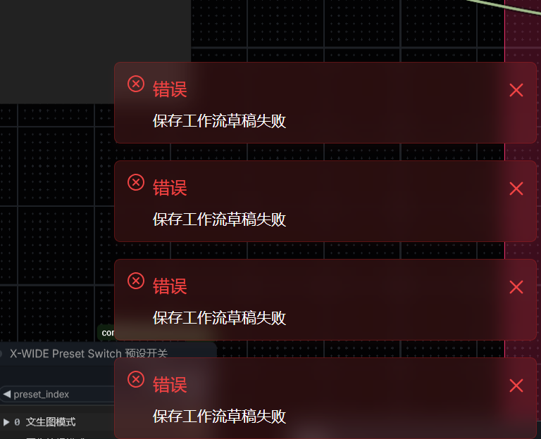

# X-WIDE Image Sender / Image Receiver

**English** | [中文](README.md)

Send an image from one place on the canvas to another: **`X-WIDE Image Sender`** sends, **`X-WIDE Image Receiver`** receives and outputs `IMAGE` / `MASK`.

This package is an independent repackaging of the `Image Sender` / `Image Receiver` nodes from [ComfyUI-Impact-Pack](https://github.com/ltdrdata/ComfyUI-Impact-Pack) by **ltdrdata (Dr.Lt.Data)**, maintained by **X-WIDE**:

> It **only improves the UI (bilingual) and fixes bugs — no new features**, and it does **not** require Impact Pack to be installed.

The transfer protocol is identical to the original (`img-send` event, `name.png [temp]` widget format), so it can be mixed with Impact Pack's sender/receiver nodes, and existing workflows can be migrated the same way.

---

## What was fixed

| # | Problem (original) | Cause | Current behaviour |
| --- | --- | --- | --- |
| 1 | **The received image stopped working after switching workflows and back** | The front-end `node.imgs` getter used `api.fetchApi(...).then(r => r)` — an identity mapping — so `res.status` was always `undefined` and `image.src` was never rewritten to `/view?...` | `image.src` is built synchronously as `/view?filename=…&type=temp&subfolder=…`, with ordered fallbacks (temp file → input folder → base64 left in older drafts) |
| 2 | **"Failed to save workflow draft" toast spam when `save_to_workflow` was enabled** | The received image was `canvas.toDataURL()`-ed into the `image_data` widget, so megabytes of base64 went into `widgets_values` → the workflow and the localStorage draft → `QuotaExceededError` | `image_data`'s value is always an empty string; base64 never reaches the workflow or the draft. It is generated on demand by `widget.serializeValue` at queue time and injected only into the API prompt |
| 3 | **Large images made the whole canvas lag** | Widget values are drawn on the canvas and fed into the text-measurement cache, and the `node.imgs` getter runs on every repaint | Widget values no longer carry base64; `node.imgs` reads a single cache and preview restoration is attempted **only once** |
| 4 | **A missing image file crashed the node** | `doit` called `LoadImage().load_image()` directly, which raises once the temp file is gone | A fallback reader is used: on failure it logs a warning and returns a 64×64 placeholder instead of breaking the workflow |



---

## Installation

**Option 1 — ComfyUI Manager (recommended)**

1. Open Manager → **Install via Git URL**;
2. Enter `https://github.com/XWIDE/comfyui-x-wide-image-sender-receiver`;
3. Restart ComfyUI and refresh the page (`Ctrl` + `F5`).

**Option 2 — manual**

```bash
cd ComfyUI/custom_nodes
git clone https://github.com/XWIDE/comfyui-x-wide-image-sender-receiver
```

No extra dependencies: only ComfyUI's bundled `torch` / `numpy` / `Pillow` and the front-end API are used.

---

## Usage

1. Add an **X-WIDE Image Sender** and connect your image to its `images` input;
2. Add an **X-WIDE Image Receiver** and wire its `image` output downstream;
3. Give both nodes the **same `link_id`** (both default to `0`).

> `link_id` can also be converted to an input and driven by a `Primitive` / `ImpactInt` node
> (same as the original). Once converted it counts as "linked" and the Receiver accepts the image.

| Node | Widget | Description |
| --- | --- | --- |
| X-WIDE Image Sender | `images` | Image(s) to send |
| | `filename_prefix` | Filename prefix used in the temp folder (default `ImgSender`) |
| | `link_id` | Pairing id — only a Receiver with the same id receives the image |
| X-WIDE Image Receiver | `image` | Filled automatically with the received temp filename; you can also pick a file from the input folder |
| | `link_id` | Pairing id |
| | `save_to_workflow` | When enabled the received image is injected into the queued prompt. The **workflow file itself is not inlined with base64** |
| | `image_data` | Image data, generated on demand by the front end; normally empty |
| | `trigger_always` | Always re-execute this node (ignore the cache) |

### Two modes

- **`save_to_workflow` off**: the Receiver loads the **temp file** recorded in the `image` widget, so the image must still exist in `ComfyUI/temp`. The preview is still restored after switching workflows and back.
- **`save_to_workflow` on**: at queue time the front end encodes the received image to base64 and injects it into the prompt's `image_data`, so execution no longer depends on the temp file — while the workflow and the draft stay small.

> ⚠️ In both modes the image itself lives in `ComfyUI/temp`. **Restarting ComfyUI clears that folder**, so send the image again afterwards. If you need an image to be permanently stored in a workflow, use `Load Image` / `Save Image` style nodes.

### "About" page

Right-click the **empty canvas** or a **node** and choose `ℹ 信息 / About`: it credits the author of this version (X-WIDE) and the original author (ltdrdata), with clickable links to both home pages, and states that this version only improves the UI and fixes bugs.

---

## Bilingual UI

The interface follows the browser language:

- Chinese: `图像 / image`, `保存到工作流 / save_to_workflow`, …
- English: the same "中文 / parameter" pairing, so the original tutorials still apply.

Node display names are `X-WIDE Image Sender 图像发送器` and `X-WIDE Image Receiver 图像接收器`; searching for `xwide`, `x-wide`, `sender`, `receiver`, `图像发送` or `图像接收` all work. The category is `X-WIDE/Image`.

---

## Relationship to Impact Pack

- This package does **not** depend on Impact Pack and can be installed on its own;
- Both packages **can be installed together**: because the protocol matches (`img-send` and the `name.png [temp]` format), the X-WIDE Sender can feed an original Receiver and vice versa;
- Node type names differ (`ImageSender` ↔ `XWIDE_ImageSender`), so both can live on the same canvas without overwriting each other.

## License and credits

- Licensed under **GPL-3.0**, see [LICENSE](LICENSE);
- The original `Image Sender` / `Image Receiver` nodes were created by **ltdrdata (Dr.Lt.Data)** in ComfyUI-Impact-Pack; copyright belongs to the original author;
- The modifications in this version are copyright **X-WIDE**. See [NOTICE](NOTICE) and [CHANGELOG.md](CHANGELOG.md) for the change list and the GPL-3.0 obligations.

Original author: <https://github.com/ltdrdata> · Original project: <https://github.com/ltdrdata/ComfyUI-Impact-Pack>

## Links

- Author page: <https://space.bilibili.com/374064919>
- Issues: <https://github.com/XWIDE/comfyui-x-wide-image-sender-receiver/issues>
